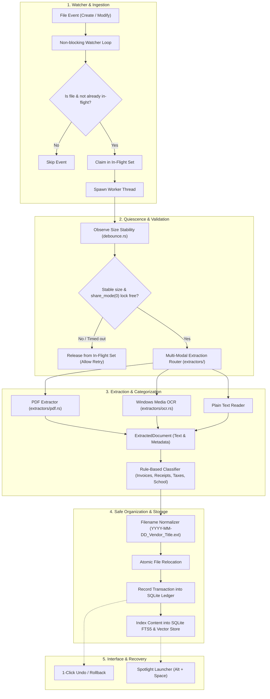

# Nori 🌊

> **The Zero-Cloud, Autonomous Desktop Organizer & Semantic Search Engine.**  
> *Watches your folder, reads documents & screenshots locally, categorizes and normalizes filenames, and guarantees a 1-click Undo safety net.*

---

[](https://www.rust-lang.org/)
[](https://microsoft.com/windows)
[](#privacy--zero-cloud-guarantee)
[](LICENSE)

---

## 💡 The Problem & The Vision

Downloads folders inevitably become digital landfills of cryptic filenames like `inv_091823(1).pdf`, unstamped screenshots (`Screenshot 2026-03-14.png`), and forgotten installation packages. Cloud-based organizing tools compromise privacy by uploading personal invoices, tax documents, and medical receipts to external servers.

**Nori** is an ultra-fast, local-first background daemon written in Rust. It quietly monitors your drop folders, waits for downloads to physically complete without freezing on lock-contentions, extracts text from documents and screenshots using native Windows APIs, organizes files cleanly, and provides an instant `Alt + Space` Spotlight launcher with hybrid full-text and semantic search.

---

## ⚡ Key Highlights

- **🛡️ Indestructible Safety Net (1-Click Undo):** Every file movement and renaming operation is recorded as an atomic transaction in an embedded SQLite ledger. If anything is misplaced, one click rolls it back to its original name and location.
- **👁️ Multi-Modal Local Eyes (Zero-Cloud Vision):**
  - **PDF Text Extractor:** Extracts text and structural metadata with strict bounds (100 MB limits, page clipping, and `catch_unwind` panic containment).
  - **Native Windows Media OCR:** Directly taps into the Windows Runtime (`Windows.Media.Ocr`) to extract text from screenshots and photos in under 50 ms with zero external cloud dependencies.
- **⏱️ Download Debounce & Quiescence Engine:**
  - Automatically suppresses transient browser download stubs (`.crdownload`, `.part`, `.tmp`).
  - Multi-sample size stability observation ensures the transfer has finished growing.
  - Windows-native `share_mode(0)` (`FILE_SHARE_NONE`) verification guarantees the writing process (Chrome, Edge, Explorer) has released all OS file handles.
- **🧵 Non-Blocking Concurrency:** The primary filesystem event loop runs on sub-millisecond execution times, dispatching file stabilization and parsing tasks to background workers while preventing duplicate concurrent processing with an `Arc<Mutex<HashSet<PathBuf>>>` registry.
- **🔍 Hybrid Instant Memory (FTS5 + ONNX Vectors):** Combines SQLite Porter-stemmed FTS5 lexical search with lightweight local vector embeddings (`fastembed`) for conceptual document discovery.

---

## 🏗️ Architecture & Processing Pipeline



---

## 🗺️ Project Roadmap & Milestones

This project follows an anti-burnout granular implementation structure:

### Phase 1: The Watcher Foundation
- [x] **Task 1.1: Rust CLI & SQLite Schema** — Embedded database initialization with `files` and `transactions` tables.
- [x] **Task 1.2: Raw Directory Watcher** — Non-blocking filesystem event listener powered by `notify`.
- [x] **Task 1.3: Download Debounce Engine** — Multi-sample size stabilization, browser extension filtering, and Windows `share_mode(0)` verification with comprehensive unit tests.

### Phase 2: The Multi-Modal Eyes
- [x] **Task 2.1: PDF Header & Text Extractor** — Memory-bounded PDF reader with password handling, page limits, and panic containment (`extractors/pdf.rs`).
- [ ] **Task 2.2: Native Windows Media OCR** — Zero-cloud image text extraction using native `Windows.Media.Ocr` (`extractors/ocr.rs`).
- [x] **Task 2.3: Multi-Modal Extraction Router** — Unified dispatcher (`extractors/mod.rs`) mapping file formats to appropriate extractors.

### Phase 3: The Smart Janitor & Safety Net
- [ ] **Task 3.1: Rule-Based Classifier** — High-confidence keyword matching for Invoices, Receipts, Taxes, School, and General files.
- [ ] **Task 3.2: Normalized Filename Builder** — Automated naming convention (`YYYY-MM-DD_<Vendor>_<Title>.<ext>`) with Windows path sanitization.
- [ ] **Task 3.3: Safe Mover & 1-Click Undo Ledger** — Atomic filesystem relocation with rollback tracking.

### Phase 4: Instant Search & Memory
- [ ] **Task 4.1: SQLite FTS5 Full-Text Indexing** — Sub-10ms keyword search with highlighted snippets.
- [ ] **Task 4.2: Semantic Similarity Reranking** — Local 384-dimensional vector embeddings with cosine reranking using `fastembed`.

### Phase 5: The Sleek Desktop Shell
- [ ] **Task 5.1: Tauri v2 System Tray** — Minimalist system tray daemon with quick actions.
- [ ] **Task 5.2: Spotlight Launcher (`Alt + Space`)** — Centered, translucent Raycast-style instant search overlay.
- [ ] **Task 5.3: End-to-End Polish & Chaos Testing** — Bulk download stress-testing and distribution builds.

---

## 📂 Codebase Layout

```text
nori/
├── Cargo.toml               # Crate dependencies & metadata (Rust 2024 Edition)
├── README.md                # Project documentation & architectural specification
├── nori.db                  # Local SQLite database (git-ignored)
└── src/
    ├── main.rs              # App bootstrap & directory discovery
    ├── watcher.rs           # Filesystem event loop & background task dispatcher
    ├── debounce.rs          # Quiescence polling, share_mode checks & unit tests
    ├── db.rs                # SQLite schema setup and migrations
    └── extractors/          # Multi-modal extraction engine
        ├── mod.rs           # Extractor router, error taxonomy & safety guards
        ├── pdf.rs           # PDF text extractor with panic isolation
        └── ocr.rs           # (Planned) Native Windows Media OCR engine
```

---

## 🗄️ Database Schema

Nori relies on embedded SQLite to ensure persistent, verifiable state:

### Table: `files`
| Column | Type | Constraints | Description |
| :--- | :--- | :--- | :--- |
| `id` | `TEXT` | `PRIMARY KEY` | Unique document ID (UUIDv4) |
| `current_path` | `TEXT` | `NOT NULL` | Current path on disk |
| `original_path` | `TEXT` | `NOT NULL` | Original path where file landed |
| `filename` | `TEXT` | `NOT NULL` | Normalized filename |
| `created_at` | `DATETIME`| `NOT NULL` | Timestamp of ingestion |

### Table: `transactions`
| Column | Type | Constraints | Description |
| :--- | :--- | :--- | :--- |
| `transaction_id` | `TEXT` | `PRIMARY KEY` | Unique transaction ID (UUIDv4) |
| `source_path` | `TEXT` | `NOT NULL` | Pre-move file location |
| `destination_path`| `TEXT` | `NOT NULL` | Post-move file location |
| `timestamp` | `DATETIME`| `NOT NULL` | Operation timestamp |
| `is_reverted` | `INTEGER`| `DEFAULT 0` | Reversion state (`0` = active, `1` = reverted) |

---

## 🚀 Getting Started

### Prerequisites

- **Operating System:** Windows 10 or 11 (64-bit)
- **Rust Toolchain:** Rust compiler supporting the **2024 Edition** (`rustc 1.85+`)
- **C Compiler Tools:** Visual Studio C++ Build Tools or Windows SDK (for bundled SQLite compilation)

### Build & Run

1. **Clone the repository:**
   ```powershell
   git clone https://github.com/your-username/nori.git
   cd nori
   ```

2. **Run tests:**
   ```powershell
   cargo test
   ```

3. **Launch the development watcher:**
   ```powershell
   cargo run
   ```
   *Drop a PDF or file into your `Downloads` directory to see the detection and extraction pipeline in real time.*

4. **Build release binary:**
   ```powershell
   cargo build --release
   ```
   The binary will be compiled to `target\release\nori.exe`.

---

## 🔒 Privacy & Zero-Cloud Guarantee

All data processed by Nori—including database indices, PDF contents, OCR text, and semantic vectors—**remains strictly on your local machine**. Nori does not make network calls, does not transmit telemetry, and requires no external API keys or cloud accounts.

---

## 📄 License

This project is licensed under the [MIT License](LICENSE).
